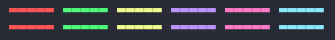
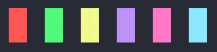
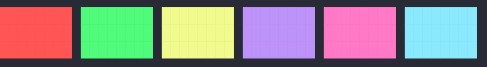
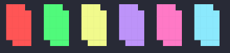

## Examples

This folder contains some screenshots to make it visually easier to understand the operation of ShowMe.
The perception of colors may differ in each terminal depending not only on the terminal itself, but also on the theme applied to it. For information, the screenshots were taken with the [Dracula](https://draculatheme.com/) color scheme.

### Patterns

- `bars`

- `blocks1`

- `bloks`

- `crunch` 

- `panes`

